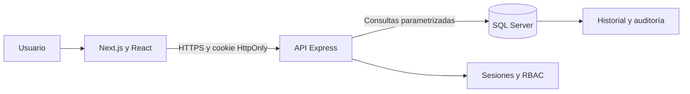

# PostulaTrack

Sistema web para centralizar oportunidades laborales y conservar la trazabilidad cronológica de cada postulación. Este repositorio implementa el incremento funcional de las HU-01 a HU-05 con dos roles: `USER` y `ADMIN`.

## Qué funciona

- Registro, inicio y cierre de sesión.
- Bloqueo temporal después de cinco credenciales incorrectas.
- Consulta y actualización del perfil.
- Registro de empresas y oportunidades desde distintas fuentes.
- Creación opcional de una postulación al guardar la oportunidad.
- Tablero de procesos y detalle de cada postulación.
- Cambio de estado mediante un procedimiento almacenado transaccional.
- Historial inmutable con estado anterior, estado nuevo, fecha, comentario y responsable.
- Panel administrativo para activar o desactivar cuentas.
- Separación de datos por propietario en todas las consultas del usuario.

Agenda, documentos, recordatorios e indicadores avanzados pertenecen a sprints posteriores y no se presentan como terminados en el menú principal.

## Arquitectura



El repositorio es un monorepo npm:

```text
PostulaTrack/
├── apps/
│   ├── web/          # Next.js, React, TypeScript y Tailwind CSS
│   └── api/          # Express, TypeScript, seguridad y acceso a datos
├── packages/
│   └── contracts/    # Esquemas Zod y tipos compartidos
├── database/         # Creación y verificación de SQL Server
├── docs/             # Arquitectura, BD, seguridad, API y Azure
└── scripts/          # Arranque simultáneo de web y API
```

## Requisitos locales

- Node.js 22.13 o posterior.
- npm 10 o posterior.
- Microsoft SQL Server 2022 Developer o Express con autenticación SQL habilitada.
- SQL Server Management Studio o la extensión MSSQL para VS Code.
- Visual Studio Code.

## Instalación desde cero

### 1. Crear la base de datos

Abre `database/001_schema.sql` en SSMS y ejecútalo con una cuenta que pueda crear bases de datos. El script crea `PostulaTrack`, los esquemas `sec`, `app` y `audit`, sus tablas, índices, catálogos y el procedimiento `app.ChangeApplicationStatus`.

Al final del archivo hay un bloque comentado para crear el login de mínimo privilegio. Reemplaza `<GENERAR_CONTRASENA_SEGURA>`, descomenta el bloque y ejecútalo. No uses `sa` desde la aplicación.

Ejecuta después `database/002_verify_installation.sql`. Debes ver los roles `USER` y `ADMIN`, nueve estados y las tablas creadas.

### 2. Configurar variables

En la raíz del repositorio:

```powershell
Copy-Item .env.example .env
```

En macOS o Linux:

```bash
cp .env.example .env
```

Edita `.env` y coloca la contraseña real de `PostulaTrackApp`. El archivo está ignorado por Git.

Para cambiar la URL de la API usada por el frontend, copia también:

```powershell
Copy-Item apps/web/.env.local.example apps/web/.env.local
```

En desarrollo local no es obligatorio porque la aplicación usa `http://localhost:4000/api` como valor predeterminado.

### 3. Instalar, compilar y ejecutar

```bash
npm install
npm run build
npm run dev
```

- Web: <http://localhost:3000>
- Salud de la API: <http://localhost:4000/health>

Si necesitas revisar cada proceso por separado, abre dos terminales y ejecuta
`npm run dev:api` en la primera y `npm run dev:web` en la segunda.

Primero crea una cuenta desde `/registro`. La cuenta nueva recibe únicamente el rol `USER`.

### 4. Crear el administrador inicial

```bash
npm run admin:create -- --email admin@postulatrack.local --password "CambiaEstaClave2026" --first-name Admin --last-name PostulaTrack
```

Usa otra contraseña real de al menos 12 caracteres, con mayúscula, minúscula y número. Este comando debe ejecutarse solo en un equipo controlado.

## Comandos

| Comando | Resultado |
|---|---|
| `npm run dev` | Inicia web y API con recarga automática. |
| `npm run dev:web` | Inicia solo Next.js en el puerto 3000. |
| `npm run dev:api` | Inicia solo Express en el puerto 4000. |
| `npm run clean` | Elimina artefactos de compilaciones anteriores. |
| `npm run typecheck` | Valida tipos de todos los workspaces. |
| `npm run build` | Compila contratos, API y web para producción. |
| `npm run admin:create -- ...` | Crea el administrador inicial. |

## Roles

| Acción | USER | ADMIN |
|---|:---:|:---:|
| Gestionar su perfil | Sí | Sí |
| Gestionar sus oportunidades | Sí | Sí |
| Consultar sus postulaciones e historial | Sí | Sí |
| Consultar postulaciones privadas de otros | No | No |
| Listar cuentas | No | Sí |
| Activar o desactivar cuentas | No | Sí |
| Consultar eventos administrativos | No | Sí |

El rol administrativo sirve para soporte de cuentas. No obtiene acceso automático al contenido privado de los postulantes.

## Publicar en GitHub

```bash
git init
git add .
git commit -m "feat: implementar MVP de PostulaTrack"
git branch -M main
git remote add origin https://github.com/TU_USUARIO/postulatrack.git
git push -u origin main
```

Antes del `git add`, confirma que `.env` y `apps/web/.env.local` no aparezcan en `git status`.

## Documentación técnica

- [Arquitectura](docs/01-arquitectura.md)
- [Base de datos](docs/02-base-de-datos.md)
- [Seguridad](docs/03-seguridad.md)
- [Roles y permisos](docs/04-roles-y-permisos.md)
- [Despliegue futuro en Azure](docs/05-despliegue-azure.md)
- [API HTTP](docs/06-api.md)

## Estado de validación

El repositorio fue compilado con `npm run build`. La prueba de integración completa requiere ejecutar SQL Server en el equipo local y colocar sus credenciales en `.env`.
