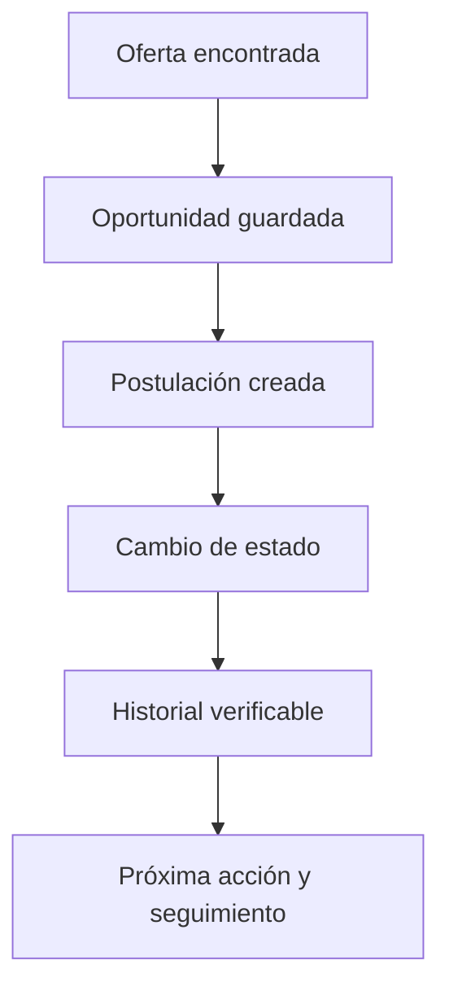

# PostulaTrack para Proyecto Integrador

## En una frase

PostulaTrack convierte la búsqueda laboral dispersa de un estudiante o egresado en un proceso personal con estado, próxima acción e historial verificable.

## Problema y usuario

El postulante guarda ofertas en diferentes portales, correos y notas. Al avanzar varios procesos en paralelo, pierde fechas y contexto: no recuerda cuándo escribió a una empresa, qué etapa sigue ni dónde está su última respuesta. El usuario primario es el estudiante o egresado que gestiona varias postulaciones; el administrador de la plataforma solo atiende cuentas y acceso. PostulaTrack permite descubrir ofertas externas, pero **no publica vacantes propias ni gestiona selección para empresas**. Esta formulación es una hipótesis que debe validarse con usuarios antes de afirmar demanda o resultados.

## Propuesta de valor

1. Reunir en un mismo lugar oportunidades registradas por el usuario, incluso si provienen de varias fuentes.
2. Registrar el proceso y cada cambio de etapa con fecha y contexto; saber qué pasó y quién lo anotó.
3. Priorizar el siguiente paso: entrevistas, seguimientos y vencimientos visibles con recordatorios cuando ese módulo esté implementado.
4. Dar visibilidad agregada de la búsqueda sin prometer empleo ni inferir automáticamente decisiones de empleadores.

## Recorrido de la solución

Hoy A→E se pueden recorrer en la web y API; A puede originarse en una oferta manual o en la búsqueda externa opcional con clave. F dispone de campos y tabla base, pero necesita un flujo web y API funcional. Un proceso «contratado» es un estado consignado por el usuario; no una verificación externa.

## Arquitectura y criterio

MVP local: navegador → Next.js → API Express → SQL Server. Contratos Zod compartidos entre web y API. No se requiere microservicios, mensajería ni dos nubes para este caso: la operación principal es un cambio transaccional de estado y su historial. SQL Server conserva la fuente de verdad; tarjetas e indicadores se recalculan desde allí. Azure es una decisión posterior condicionada por presupuesto, necesidad de acceso remoto y operaciones.

Ver [arquitectura](01-arquitectura.md), [fuente de verdad](09-FUENTE-DE-VERDAD.md) y [decisiones](decisions/README.md).

## Qué entregar en el curso

| Entrega | Evidencia esperada |
|---|---|
| Problema de negocio | Entrevistas breves o prueba de uso con estudiantes; hipótesis y hallazgos, sin datos personales en el repositorio. |
| Flujo funcional | Registro → oportunidad → postulación → actualización de estado → historial → próxima acción. |
| Arquitectura | Diagrama de componentes, dueño de los datos, controles de acceso y límites del despliegue. |
| Resultado medible | Datos de prueba, fórmulas y comparación con línea base; sin inventar impacto. |
| Producto visual | Estados vacíos, errores, móvil y escritorio; no mezclar ejemplos estáticos con registros reales. |

La primera lectura del repositorio debe seguir este orden: [estado real](07-ESTADO-Y-EVIDENCIA.md) → [negocio](08-NEGOCIO-Y-METRICAS.md) → [especificación siguiente](../specs/001-seguimiento-accionable/spec.md) → [plan](../specs/001-seguimiento-accionable/plan.md) → [tareas](../specs/001-seguimiento-accionable/tasks.md).
