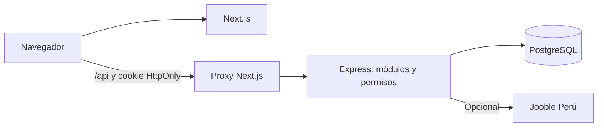

# Arquitectura de PostulaTrack · PostgreSQL

El navegador descarga la interfaz Next.js y llama a `/api` en el **mismo origen**. Next.js redirige esa ruta a Express por `API_INTERNAL_URL`; solo Express conoce `DATABASE_URL`, autoriza sesiones y consulta PostgreSQL. Next.js y Express se compilan y despliegan como procesos independientes dentro del mismo monorepo. Separar repositorios no reduce por sí mismo la latencia.

| Límite | Implementación | Propiedad |
|---|---|---|
| Presentación | `apps/web` | UI, formularios y renderizado. |
| Contrato compartido | `packages/contracts` | Validación de datos del HTTP; no es el alcance del producto. |
| Dominio y autorización | `apps/api/src/modules` | Sesión, roles, propietario y transacciones. |
| Acceso a datos | `apps/api/src/database/pool.ts` | Pool `pg`, consultas parametrizadas y cierre de transacciones. |
| Persistencia | `database/postgres` | Esquema, índices y verificación de integridad. |

Los procesos se pueden alojar en plataformas distintas. PostgreSQL se puede cambiar de Supabase a Azure Database for PostgreSQL con una migración y una nueva `DATABASE_URL`, más pruebas de compatibilidad y restauración. No se usa Supabase Auth ni su cliente desde el navegador; la sesión propia de PostulaTrack se guarda en `sec.sessions`. El SQL y las decisiones de producto se registran en [fuente de verdad](16-PLAN-FUENTE-DE-VERDAD.md). ML y chatbot todavía no forman parte de la ruta operacional; tendrán contratos propios después de probar autorización y rendimiento.
