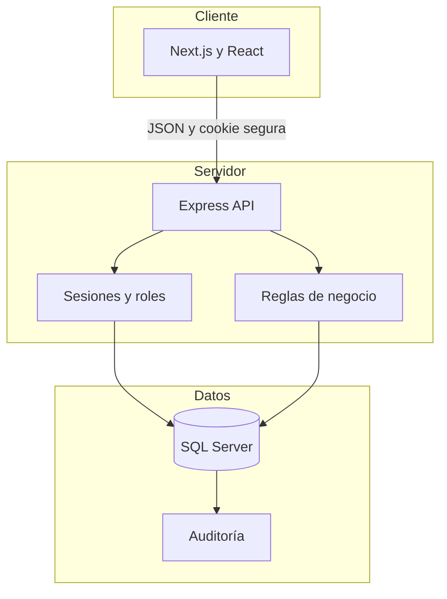

# Arquitectura de PostulaTrack

## Decisión tecnológica

Se usa TypeScript en frontend y backend para compartir contratos y detectar errores antes de ejecutar. Next.js y React permiten una interfaz mantenible; Express mantiene la API desacoplada; SQL Server aporta relaciones, restricciones, transacciones e índices adecuados para preservar trazabilidad.

## Capas

| Capa | Responsabilidad | Ubicación |
|---|---|---|
| Presentación | Pantallas, accesibilidad, formularios y estados de carga | `apps/web` |
| API | Autenticación, autorización, validación y reglas | `apps/api` |
| Contratos | Tipos y validaciones compartidos con Zod | `packages/contracts` |
| Datos | Integridad, persistencia, historial y auditoría | `database` |

## Flujo principal

1. El usuario crea una cuenta o inicia sesión.
2. La API entrega una cookie de sesión opaca y `HttpOnly`.
3. El usuario registra una oportunidad y puede convertirla en proceso.
4. La API valida propietario y datos, y usa parámetros SQL.
5. Cada cambio de estado se ejecuta dentro de una transacción.
6. El estado actual se actualiza y el historial se inserta sin sobrescribir registros anteriores.

## Camino hacia Azure

La separación entre web, API y base de datos permite migrar sin reescribir el dominio: Azure Static Web Apps o App Service para Next.js, Azure App Service para Express, Azure SQL Database para datos, Key Vault para secretos y Application Insights para observabilidad.
