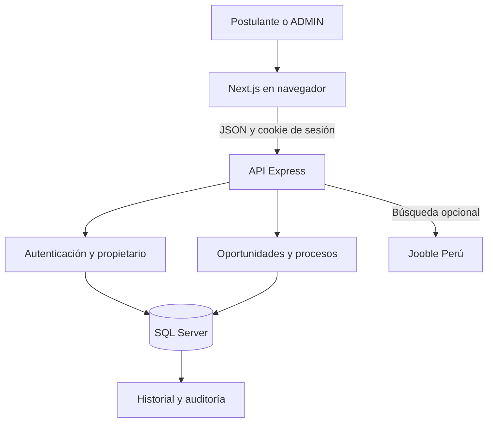

# Arquitectura de PostulaTrack

**Estado:** monolito modular local de web y API, con SQL Server como única base autoritativa. El objetivo es una aplicación web útil y desplegable; los servicios Azure del documento 05 son opcionales y aún no están desplegados. Véase [estado y evidencia](07-ESTADO-Y-EVIDENCIA.md).

El repositorio **ya es un monorepo**: `apps/web`, `apps/api`, `packages/contracts`. Son procesos independientes en desarrollo y pueden publicarse como dos artefactos separados. Renombrarlos a `frontend` y `backend` no cambia acoplamiento ni latencia. Los contratos compartidos y la autorización en la API evitan duplicar reglas; el navegador nunca se conecta directamente a SQL Server.

## Decisión tecnológica

Se usa TypeScript en frontend y backend para compartir contratos y detectar errores antes de ejecutar. Next.js y React permiten una interfaz mantenible; Express mantiene la API desacoplada; SQL Server aporta relaciones, restricciones, transacciones e índices adecuados para preservar trazabilidad.

## Capas

| Capa | Responsabilidad | Ubicación |
|---|---|---|
| Presentación | Pantallas, accesibilidad, formularios y estados de carga | `apps/web` |
| API | Autenticación, autorización, validación y reglas | `apps/api` |
| Contratos | Tipos y validaciones compartidos con Zod | `packages/contracts` |
| Datos | Integridad, persistencia, historial y auditoría | `database` |

## Flujo principal

1. El usuario crea una cuenta o inicia sesión.
2. La API entrega una cookie de sesión opaca y `HttpOnly`.
3. El usuario registra una oportunidad y puede convertirla en proceso.
4. La API valida propietario y datos, y usa parámetros SQL.
5. Cada cambio de estado se ejecuta dentro de una transacción.
6. El estado actual se actualiza y el historial se inserta sin sobrescribir registros anteriores.

## Límites y decisiones

- Web muestra estado, API aplica autorización y validación, SQL Server confirma la transacción; los contratos Zod compartidos reducen diferencias de formato.
- API y SQL Server forman un único núcleo operacional. No añadir cola, ML, GenAI o microservicios solo para ampliar el diagrama: no resuelven hoy el seguimiento del postulante.
- Las pantallas `agenda` y `empresas` contienen ejemplos estáticos y no están en el flujo autoritativo.
- La búsqueda `GET /api/jobs` usa una API externa opcional; solo el usuario puede guardar una oferta y convertirla luego en proceso. Ver [ADR-004](decisions/004-busqueda-externa.md).
- Despliegue público, backup, observabilidad y rendimiento con muchos usuarios requieren prueba propia. Ver [decisiones](decisions/README.md) y [fuente de verdad](09-FUENTE-DE-VERDAD.md).
- Los catálogos cortos de país y carrera son sugerencias locales de la UI, con opción `Otro`; la API persiste el valor libre validado. Una API de catálogo tendría sentido cuando se necesiten códigos normalizados, localización, administración o sincronización con un proveedor.

## Camino hacia Azure

La separación entre web, API y base de datos permite migrar sin reescribir el dominio: Azure Static Web Apps o App Service para Next.js, Azure App Service para Express, Azure SQL Database para datos, Key Vault para secretos y Application Insights para observabilidad.
