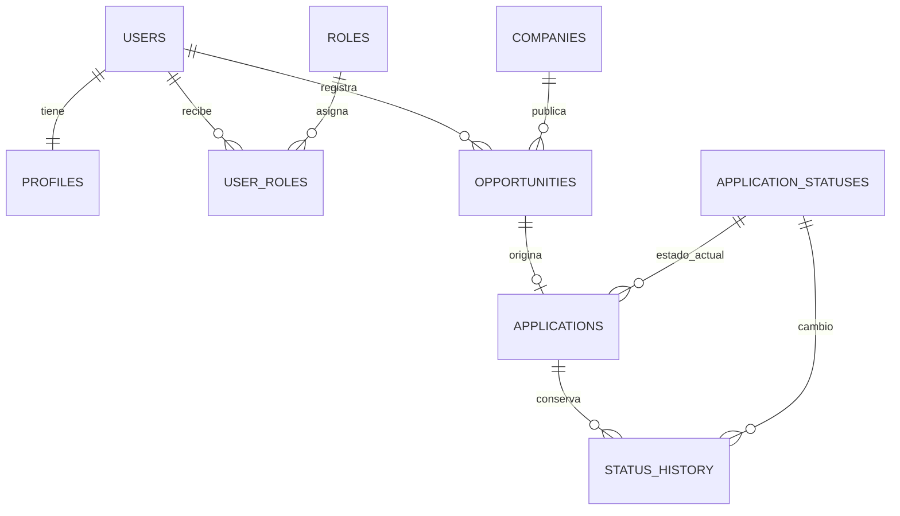

# Base de datos

## Tipo elegido

PostulaTrack utiliza una base de datos relacional Microsoft SQL Server. La trazabilidad exige relaciones consistentes entre usuario, empresa, oportunidad, postulación, estado e historial; también requiere transacciones para que un cambio de estado no quede registrado a medias.

## Esquemas

| Esquema | Contenido |
|---|---|
| `sec` | Usuarios, roles, sesiones y credenciales derivadas. |
| `app` | Perfil, empresas, oportunidades, postulaciones, historial, documentos y actividades. |
| `audit` | Eventos sensibles de seguridad y administración. |

## Acciones principales

- `INSERT`: registro de cuenta, perfil, empresa, oportunidad, proceso e historial.
- `SELECT`: paneles y consultas filtradas siempre por `OwnerUserId`.
- `UPDATE`: perfil, bloqueo de cuenta, sesión, estado actual y activación administrativa.
- `DELETE`: no se concede a la cuenta de la aplicación; los registros funcionales usan baja lógica.

El procedimiento `app.ChangeApplicationStatus` bloquea la fila, valida propietario y estado, actualiza el proceso, inserta el historial y registra auditoría dentro de la misma transacción.

## Alta escala

- Índices compuestos por propietario, estado y fecha.
- Pool de conexiones con límite configurable.
- Paginación pendiente antes de superar decenas de miles de filas por usuario.
- Azure SQL permite escalar capacidad sin cambiar consultas principales.
- Documentos futuros deben almacenarse en Blob Storage; SQL conserva solo metadatos, hash y clave de almacenamiento.
