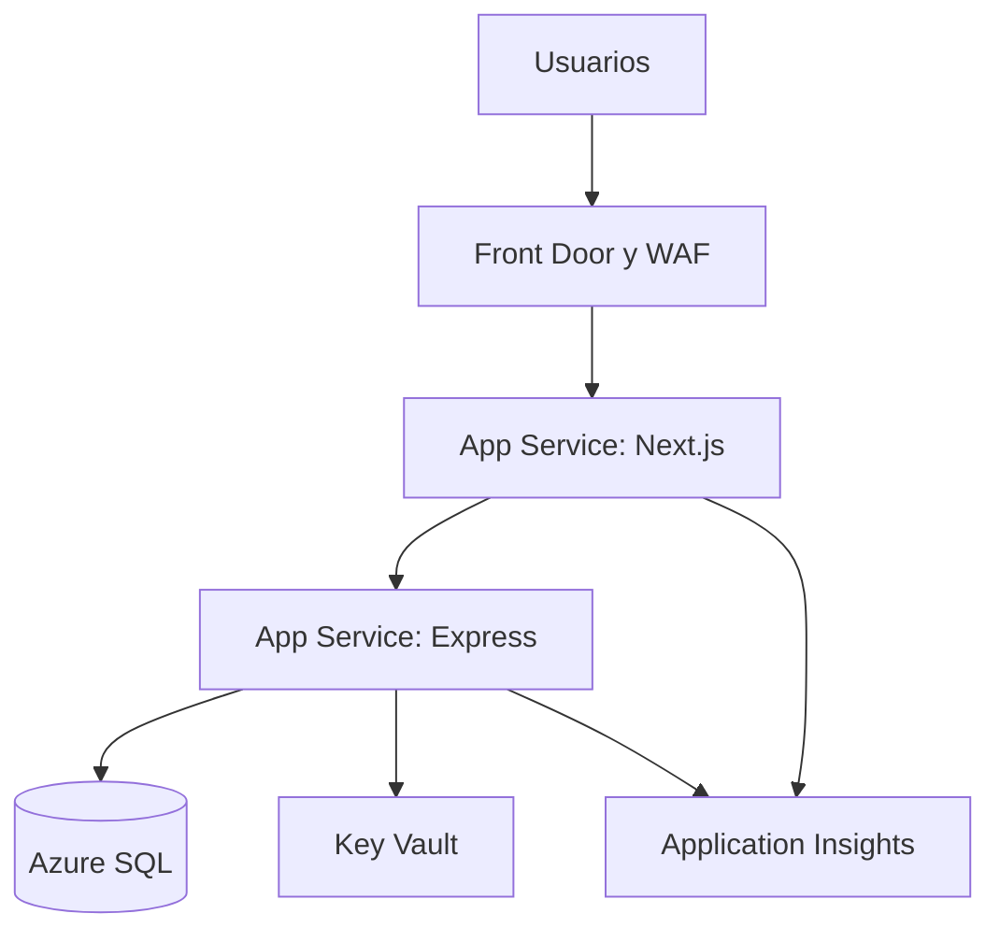

# Despliegue futuro en Azure

## Arquitectura propuesta

## Estrategia híbrida

Durante desarrollo, SQL Server, web y API funcionan localmente. En producción, los tres componentes se migran a servicios administrados. Una fase híbrida puede mantener la base local solo para pruebas, nunca exponerla directamente a Internet.

## Pasos de migración

1. Crear Azure SQL Database y ejecutar los scripts versionados.
2. Crear una identidad administrada o credencial de mínimo privilegio.
3. Guardar secretos en Key Vault.
4. Publicar API y configurar `WEB_ORIGIN`, cifrado SQL y HTTPS.
5. Publicar Next.js con `NEXT_PUBLIC_API_URL` apuntando a la API.
6. Restringir red entre API y SQL mediante endpoints privados cuando el presupuesto lo permita.
7. Activar Application Insights, alertas, copias de seguridad y pruebas de restauración.

## Alta disponibilidad

La primera versión local no ofrece un SLA contractual. Si UTP contrata el servicio, el proveedor definido en el contrato operará la solución y responderá ante incumplimientos. Las penalidades se aplican al proveedor, no al usuario final, y deben relacionarse con créditos de servicio medibles, exclusiones y límites. Azure aporta redundancia, pero el SLA del producto depende de toda la cadena, no solo de la base de datos.
