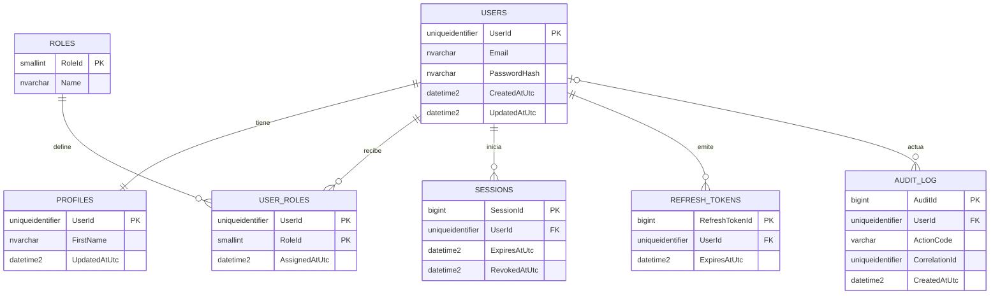
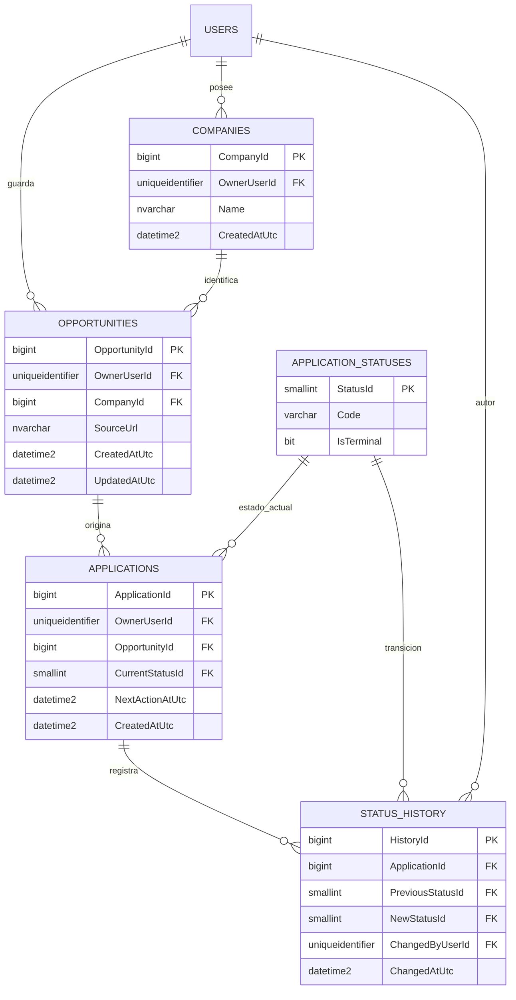
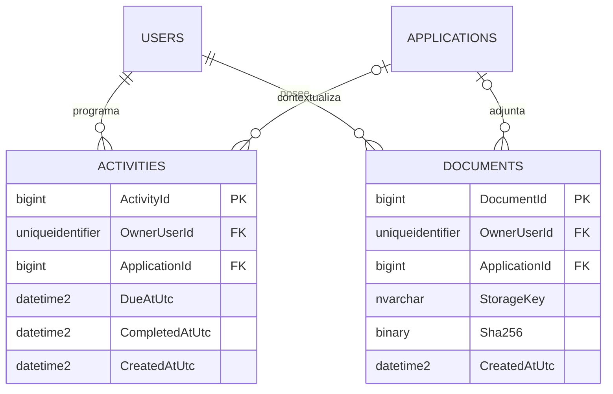

> **Nota de versión (2026-10-07):** este documento describe decisiones o evidencias de la etapa SQL Server. Para la arquitectura, instalación y estado vigentes usa `README.md`, `docs/01-arquitectura.md`, `docs/07-ESTADO-Y-EVIDENCIA.md` y `docs/16-PLAN-FUENTE-DE-VERDAD.md`. No ejecutes scripts SQL Server en PostgreSQL.

# Modelo de datos y trazabilidad

La complejidad responde a tres necesidades: aislar datos por usuario, conservar la evolución de cada postulación y poder explicar acciones sensibles con fecha UTC. SQL Server es la fuente de verdad; el navegador no guarda un historial paralelo. Los diagramas muestran tablas existentes en `001_schema.sql`; las nuevas claves compuestas se aplican con `003_owner_integrity.sql` después de verificar datos existentes.

## Identidad y acceso (implementado)

`RefreshTokens` forma parte del esquema, pero la sesión web actual usa `Sessions`. `AuditLog` no es un registro universal automático: el código debe insertar un evento en las operaciones que audita. No guardar contraseñas, tokens, textos de ofertas ni cuerpos de prompts en `DetailsJson`.

## Seguimiento laboral (implementado)

La oportunidad puede nacer de un ingreso manual o de una oferta externa que el usuario decidió guardar. `SourceName` y `SourceUrl` conservan la procedencia; la API de Jooble no escribe resultados de búsqueda en SQL. `app.ChangeApplicationStatus` cambia el estado, inserta el historial y escribe auditoría en una única transacción. Las creaciones de oportunidades y postulaciones, y el archivado de oportunidades, también generan auditoría al confirmar la transacción. El `HistoryId` ordena transiciones incluso si dos tienen el mismo segundo en `ChangedAtUtc`.

## Agenda y archivos (estructuras preparadas, flujo aún pendiente)

Las claves compuestas de `003` impiden en SQL que una oportunidad apunte a la empresa de otra cuenta o que una postulación, actividad o documento apunte a recursos de otro dueño. Las claves simples anteriores se conservan para compatibilidad. `Documents` solo define metadatos; todavía no existe flujo de carga ni almacenamiento privado implementado. `Activities` tampoco constituye un recordatorio funcional por sí sola.

## Extensiones propuestas (no implementadas)

| Necesidad | Diseño candidato | Regla antes de implementarlo |
|---|---|---|
| Ofertas repetidas de portales | Identidad `(OwnerUserId, Provider, ExternalJobId)` vinculada a `OpportunityId` | Validar disponibilidad de ID y términos del proveedor; migrar ofertas existentes sin inventar IDs. |
| Recordatorios | Entregas con `ActivityId`, canal, intento, fecha y estado | Definir consentimiento, horario, reintentos e idempotencia antes de enviar. |
| Asistente de carrera | Metadatos de ejecución: usuario, postulación, versión, latencia, costo y evaluación | No guardar automáticamente prompts ni respuestas con datos personales; revisión humana. |

No se crean esas tablas todavía: primero hay que cerrar sus reglas de negocio y probar sus flujos. Una tabla vacía no demuestra una funcionalidad.

## Orden de instalación y comprobación

1. Base nueva: ejecutar `001_schema.sql` en SSMS, después `003_owner_integrity.sql` y `004_verify_traceability.sql`.
2. Base existente: hacer copia de seguridad, revisar datos y ejecutar solo `003_owner_integrity.sql` una vez sin escrituras concurrentes. Es reejecutable y aborta si detecta relaciones cruzadas.
3. Ejecutar `004_verify_traceability.sql`: cuatro FK habilitadas y confiables; la consulta de discrepancias entre estado actual y último historial debe devolver **cero filas**.
4. Con dos usuarios de prueba, comprobar que el segundo no pueda asociar su actividad o postulación con un recurso del primero, incluso por SQL con una conexión controlada. Verificar que el rechazo no cree auditoría de éxito.

La migración fue revisada como código; su ejecución en tu SQL Server aún necesita evidencia. La auditoría de creaciones solo se aplica a operaciones posteriores al despliegue del nuevo código; no se fabrican eventos históricos.
